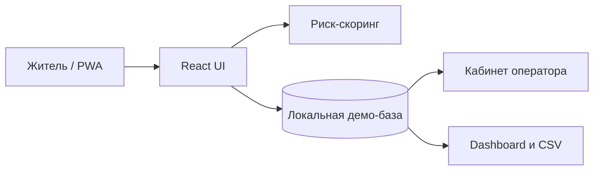
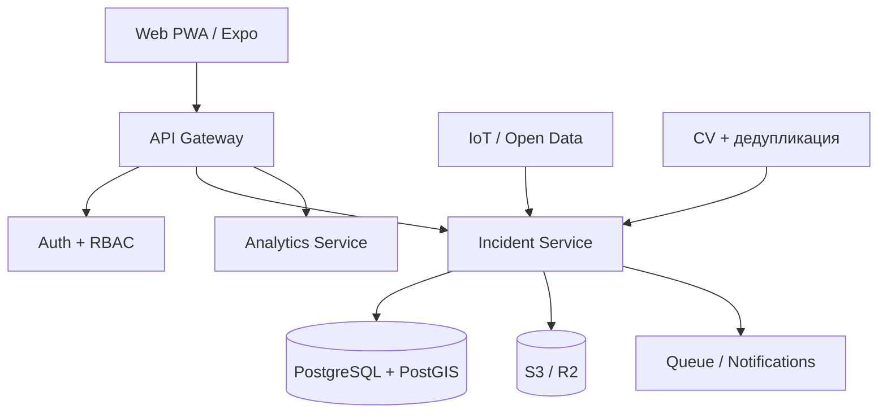

# Архитектура EcoQorgau

## 1. Архитектура MVP



В хакатонной версии все ключевые действия воспроизводимы без API-ключей. Геоподложки Leaflet используют публичные CARTO/OSM, OpenTopoMap и Esri-тайлы при наличии сети; при сбое интерфейс сохраняет стилизованный фон, маркеры и все сценарии обращений.

## 2. Целевая архитектура пилота



## 3. Модель инцидента

```ts
type Incident = {
  id: string;
  title: string;
  location: string;
  category: "oil" | "waste" | "water" | "wildlife" | "poaching";
  priority: "critical" | "high" | "medium" | "low";
  status: "new" | "verified" | "in_progress" | "resolved";
  score: number;
  time: string;
  x: number;
  y: number;
  lat: number;
  lng: number;
  reports: number;
  team?: string;
};
```

## 4. Почему скоринг объяснимый

В MVP не заявляется несуществующая обученная модель. Приоритет рассчитывается детерминированно из понятных факторов: опасность категории, срочность, наличие фото и полнота описания. Жюри может проверить формулу в коде, изменить входные параметры и увидеть результат.

В пилоте baseline сравнивается с ML/CV-моделью. Окончательное решение остаётся за экспертом, а журнал хранит входные данные, версию модели и объяснение оценки.

## 5. Производительность

- Leaflet подгружается динамически только для экранов с картой;
- нет тяжёлой библиотеки графиков: аналитика построена на CSS и SVG;
- UI строится на React, CSS и SVG;
- вычисляемые списки мемоизированы;
- глобальные события `online/offline` имеют cleanup;
- Service Worker регистрируется отложенно;
- анимации ограничены `transform` и `opacity`;
- поддерживается `prefers-reduced-motion`;
- списки ограничены рабочей областью и используют внутренний scroll.

При росте реестра свыше 500–1000 строк следует добавить серверную пагинацию и виртуализацию.

## 6. Безопасность целевой версии

- OIDC/ЕСИА-подобная авторизация для сотрудников;
- RBAC: житель, оператор, эксперт, руководитель, администратор;
- публичная геопозиция округляется, точная — только для служб;
- фото проверяются, очищаются от EXIF и хранятся по подписанным URL;
- rate limit, антиспам, дедупликация и ручная модерация;
- журнал изменений append-only;
- резервное копирование и политика хранения данных;
- аудит зависимостей и CSP.
